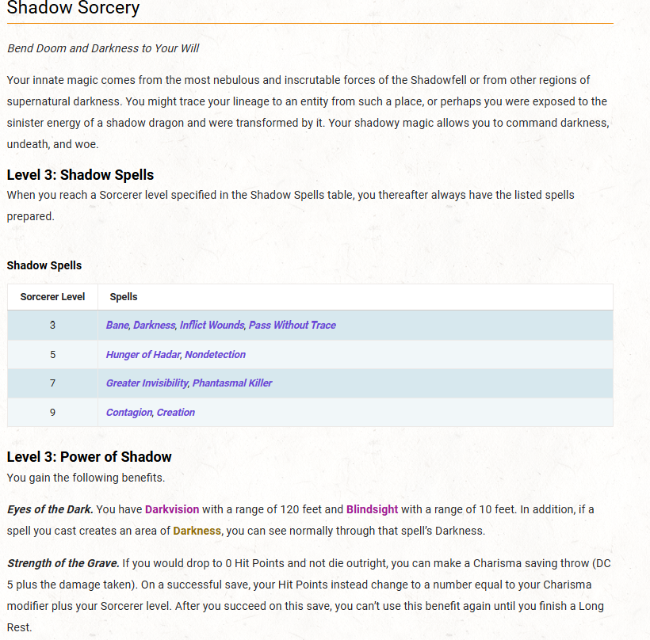

# Esren - Hollowmere

Long lost Wife - **Sorrel - Hollowmere\**

HP: 20 (rolles: 6, 4, 4)

**STR**	8 (−1)
**DEX**	14 (+2)
**CON** 10 (+0)
**INT**	16 (+3)
**WIS**	8 (−1)
**CHA** 17 (+3)

once per day, cast modify memory.

Magic Initiate -- **Sleep**, or **Friends**

Sleep -- once per day for free

Persuasion
Deception
Intimidation
Sleight-of-Hand
Investigation ( has no memory of this skill)

Sorc Points: 3

**Subtle Spell** (1 pt) **--** cast it without any Verbal, Somatic, or Material components

**Twinned Spell (1 pt) --** target two creatures

0 Message
0 Prestidigitation
0 Minor Illusion
0 Mind Sliver

1 Color Spray
1 Charm Person
1 Disguise Self
1 Distort Value
1 Bane
1 Inflict Wounds

2 Suggestion
2 Tasha's Mind Whip
2 Darkness
2 Pass without Trace

**Mind Sliver:**
You drive a disorienting spike of psychic energy into the mind of one creature you can see within range. The target must succeed on an Intelligence saving throw or take 1d6 psychic damage and subtract 1d4 from the next saving throw it makes before the end of your next turn.

LUCKY

**Luck Points.** You have a number of Luck Points equal to your Proficiency Bonus and can spend the points on the benefits below. You regain your expended Luck Points when you finish a Long Rest.

**Advantage.** When you roll a d20 for a D20 Test, you can spend 1 Luck Point to give yourself Advantage on the roll.

**Disadvantage.** When a creature rolls a d20 for an attack roll against you, you can spend 1 Luck Point to impose Disadvantage on that roll.

Shadow
http://dnd5ed.wikidot.com/sorcerer:shadow

**Eyes of the Dark.** Darkvision 120 ft. 10 feet of blind site -- i can see through my own darkness. 

**Strength of the Grave.** If you would drop to 0 Hit Points and not die outright, you can make a Charisma saving throw (DC 5 + the damage taken). On a successful save, your Hit Points instead change to a number equal to your Charisma modifier + Sorcerer level. After you succeed on this save, you can't use it again until you finish a Long Rest. *(No effect vs radiant damage or a critical hit.)*

